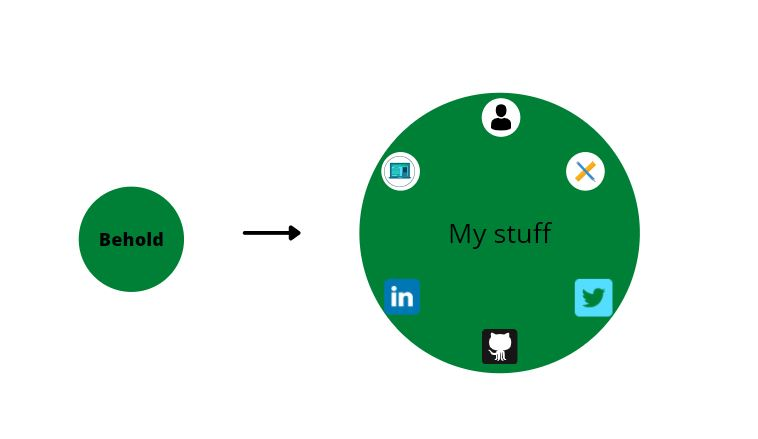

# WORK IN PROGRESS
# My Site

Build and host a site showing my work and links to external sites

## Home page

This is going to be an animated navbar, 6 links 

- Me
- projects
- async article (to add more in future)
- and three links to github, LinkedIn and Twitter

Ran into problems with putting the images in the navbar, then looked up how to add icons. React has a package that solved this 😁

- [React Icons link](https://dev.to/kevsmss/easiest-way-to-use-icons-in-react-h0o)

### Links 
- external links up and running
- need to add text of what icon is for when hovering on them ✔

Thinking of using React Route to move between the three other pages, need to refresh myself on using this

[React Route](https://reactrouter.com/web/guides/quick-start)

Route is working, but I don't want this at the top of the page, will need to look into this.